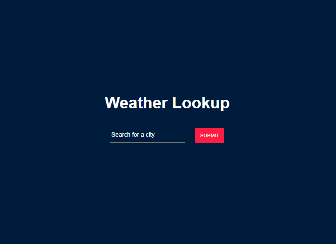
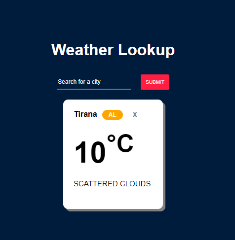
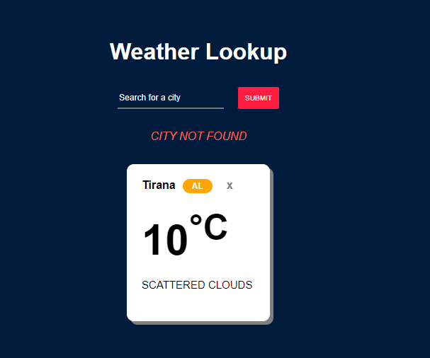

Simple React-based App to lookup weather in different cities using OpenWeather API.

**Inspiration: [Build a Weather App With Vanilla JavaScript](https://www.youtube.com/watch?v=2XTKONGhz5g&t=25s) by George Martsoukos**

Commands to use:

> yarn install

> yarn start

Screenshots of the app

